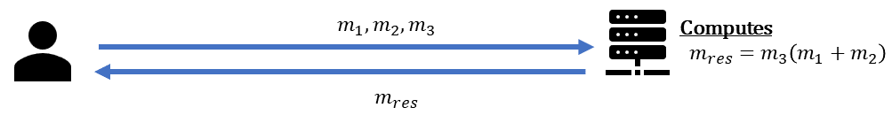
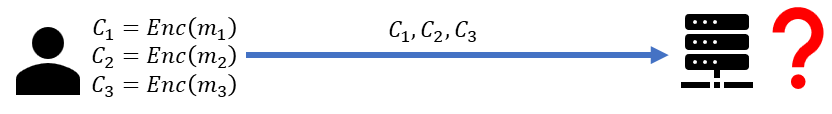
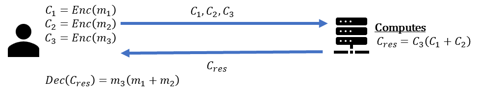
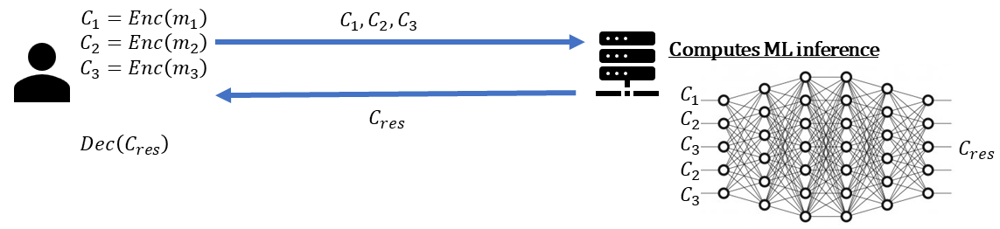

Protecting data confidentiality happens in three main locations. 

- **At rest**, e.g., by using symmetric encryption such as [AES-GCM](https://doi.org/10.6028/NIST.SP.800-38D) or [AES-XTS](https://doi.org/10.6028/NIST.SP.800-38E). 
- **In transit**, e.g., by using cryptographic protocols such as [TLS 1.3](https://www.rfc-editor.org/rfc/rfc8446).
- **In use**, e.g., by using Fully Homomorphic Encryption (FHE).

This page provides a short overview of how FHE assists in protecting data confidentiality while in use. Consider the following simple scenario with two parties a data owner and an untrusted server, where the data owner wishes to use the server to perform some computations over its data $m_i$, $i=1,2,3$. 

For that, it sends $m_i$ (maybe using a secure channel such as [TLS 1.3](https://www.rfc-editor.org/rfc/rfc8446)) to the server, which can evaluate some mathematical operations on top of this data. Once done, the server ships the results $m_{res}$ back to the data owner.

The issue is that the untrusted server can learn the confidential information $m_i$. To avoid that, the data owner may attempt to use some standard encryption method such as AES to encrypt the data into ciphertexts $c_i = Enc(m_i)$. However, this blocks the server from performing any computation on the data, i.e., it can only be used as a storage server, which misses the goal of using that server, to begin with.

That is exactly the place where FHE can help, as it enables the data owner to perform computations on encrypted data. With FHE, the data owner can encrypt its confidential data $c_i = Enc(m_i)$, and upload it to the untrusted server, which can perform operations like multiplication and addition over the ciphertexts $c_i$, without learning anything on the original data $m_i$. When the data owner decrypts the result, it should be the same as if it were done unencrypted (rounded within a certain error tolerance). **Only the data owner who owns the private key can decrypt and observe the result.**

Using additions and multiplications is enough for performing many types of operations in an untrusted environment. For example, performing deep neural network inference operations.

To learn more about the FHE technology see the [FHE FAQ](#fhe-faq) section below, or use some recommended [external resources](resources.md#fhe)

### FHE FAQ

??? Question "What does a scheme mean in FHE?"
    An FHE cryptographic scheme is a specific set of algorithms that describe the underlying mathematics being used to perform homomorphic calculations. Different schemes provide different capabilities and have different characteristics.

??? Question "What capabilities mdoern FHE schemes provide"
    Exact FHE schemes such as BGV, B/FV, and TFHE provide at least the following set of operations:

    - Encryption $c=Enc(m)$ - that recieves a data message $m$ and encrypts it to a ciphertext $c$.
    - Decryption $m=Dec(c)$ - that recieves a ciphertext $c$ and decrypt it to the underlying data message $m$.
    - Addition $c_{add}=Enc(c_1, c_2)$ - that recieves two ciphertext $c_1, c_2$ and add them such that $$Dec(c_{add}) = Dec(Enc(c_1)) + Dec(Enc(c_2))$$.
    - Multiplicaiton $c_{mul}=Enc(c_1, c_2)$ - that recieves two ciphertext $c_1, c_2$ and multiply them such that $$Dec(c_{add}) = Dec(Enc(c_1)) * Dec(Enc(c_2))$$.

    Apprixmated FHE schemes such as CKKS provide at least the following set of operations for some small $\epsilon$:

    - Encryption $c=Enc(m)$ - that recieves a data message $m$ and encrypts it to a ciphertext $c$.
    - Decryption $m = Dec(c) + \epsilon$ - that recieves a ciphertext $c$ and decrypt it to the underlying data message $m$.
    - Addition $c_{add}=Enc(c_1, c_2)$ - that recieves two ciphertext $c_1, c_2$ and add them such that $$Dec(c_{add}) = Dec(Enc(c_1)) + Dec(Enc(c_2))  + \epsilon $$.
    - Multiplicaiton $c_{mul}=Enc(c_1, c_2)$ - that recieves two ciphertext $c_1, c_2$ and multiply them such that $$Dec(c_{add}) = Dec(Enc(c_1)) * Dec(Enc(c_2))  + \epsilon $$.

??? Question "What FHE schemes exist and why would I use one over the other?"
    There are different cryptographic schemes such as BGV, B/FV, TFHE and CKKS. They differ by the type of input they recieve and output they provide. For example, BGV, B/FV and TFHE operate on integers (e.g. doing a database lookup and checking to see if two numbers are the same) while CKKS is best used with real or complex numbers (e.g. AI/ML applications like neural networks).

??? Question "Is FHE quantum-safe and what does quantum-safe mean?"
    Yes, modern FHE is considered to be quantum-safe. Quantum-safe encryption algorithm maintains the confidentiality of encrypted data even in the presence of large quantum computers. Most FHE schemes today rely on lattice-based cryptography, which is considered secure against quantum attacks. 

??? Question "How is FHE different from a Trusted Execution Environment?"
    With a Trusted Execution Environment (TEE), one can run computations on unencrypted data with a hardware enforced root of trust. A TEE is intended to be secure by design, however if an application running within it had a security issue (insecure code, application code deployed with malicious malware, zero day exploit, etc), your data may be exposed and an attacker might be able to exfiltrate or manipulate your data.

    But with FHE, data remains encrypted at all times even during data leakage or exfiltration. FHE (which guarantees data confidentiality at all times) and a TEE (which provides data integrity) can be combined to secure your 'crown jewel' sensitive data.

??? Question "What are low level primitives?"
    Low level primitives are the base operations that can be performed directly on ciphertext and include multiplication, addition, and rotation. All higher level functions are implemented in terms of low level primitives, which make them homomorphic as well. 

??? Question "What are high level primitives?"
    Complex operations like operations on matrices or arrays are built upon the low level primitives. These operations, e.g., [tile tensors](resources.md#tile-tensors), are already implemented and provided by HElayers.

??? Question "Is FHE Turing complete?"
    FHE is Turing complete because, in theory, it can perform any function that is computable. Even approximate schemes that until recently were not considered turing complete schemes are now such, see [BLEACH](https://eprint.iacr.org/2022/1298)
