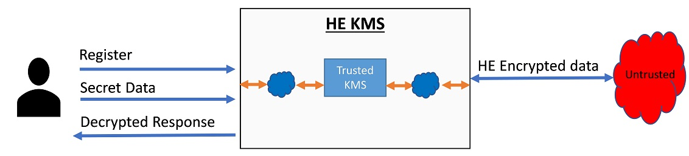
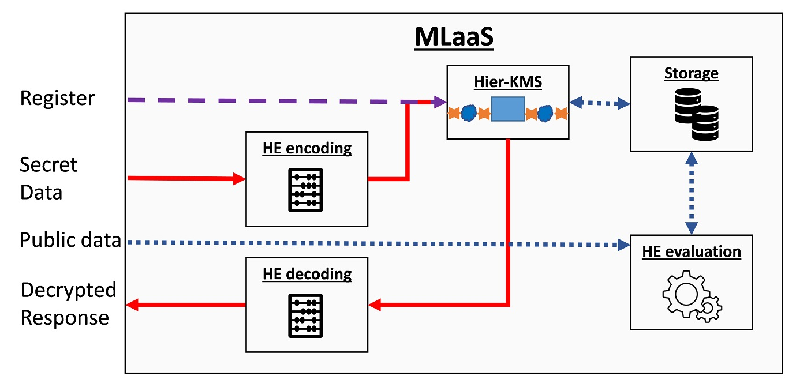

### KMS implementations
KMS implementations can use different technologies, which provide different integrity guarantees and performance capabilities. For example, KMS can be implemented

- **In software**, where we need to trust the underlying execution layers such as the OS, BIOS, VMM, and HW. 
- **In software under some Trusted Execution Environemnt (TEE)** such as [IBM Hyper Protect Virtual Server (HPVS)](https://www.ibm.com/cloud/hyper-protect-virtual-servers) or [Intel SGX](https://www.intel.com/content/www/us/en/developer/tools/software-guard-extensions/overview.html), where we primarily need to trust just the hardware.
- **In hardware**, e.g., by using an HSM such as [IBM Systems cryptographic HSMs](https://www.ibm.com/products/pcie-cryptographic-coprocessor), which often offers the highest security guarantees.

Specifically, for FHE, no off-the-shelf HSM solutions exist, mostly because of the large size of the different keys and the huge amoutn of traffic they need to handle. Today, HE-based KMS solutions should have combined HW+SW solutions. Below we describe one such solution.

???+ warning "Commercial application should rely on KMS standards"
    Commercial applications should be assisted with security and cryptography experts before using the following examples.

    To ensure proper handling of keys throughout their life-cycle, standards organizations such as NIST provide KMS recommendations such as [FIPS 800-57](https://doi.org/10.6028/NIST.SP.800-57pt1r5) and further recommend using them as part of their security requirements for cryptographic modules e.g., [FIPS 140-2](https://doi.org/10.6028/NIST.FIPS.140-2). While these guidelines provide general recommendations, they do not necessarily capture issues and concerns that are specific to HE. Commercial applications should be aware of that gap that is also analyzed [here]().

### Hierarchical-KMS

We present a KMS design that we call Hierarchical KMS. HKMS leverages current standard KMS/HSM solutions that provide symmetric encryption/decryption capabilities to a KMS, which in turn provides FHE capabilities. The Figure below illustrates at a high level design of HKMS.

It provides at least the following three APIs: *register*, *encryption*, and *decryption*. A user uses the registration API to let the KMS know that a new set of keys is required. The KMS is responsible for associating the user credentials with the newly generated keys. After successful registration, the user can use its credentials to identify itself to the KMS and perform encryption and decryption operations on its data using the generated key set. 

??? note "HKMS location"
    The HKMS does not need to be implemented at one location, i.e., at the cloud servers or the client side and that there are different ways to implement it.

Although HKMS provides encryption/decryption capabilities, it does not aim to provide a full HEaaS solution. As mentioned above, it is even better to separate those capabilities to reduce the size and scope of the KMS implementation and thereby reduce the potential attack surface.

The next figure presents a possible HEaaS solution that uses HKMS. This solution can be implemented over several locations, e.g., some components can be implemented on the client side while others are implemented on the untrusted cloud site. 

- A user always starts by submitting a registration command that transparently goes to the HKMS. 
- The HKMS generates the keys, which it can store locally in plaintext or encrypted at some external storage location. 
- The user can then upload secret data or code, encode it using some HE compiler, e.g., HELayers, and encrypt it using the KMS. 
- After encryption, the data can be stored at some storage location or delivered directly to the HE evaluation unit. 
- In addition, the user can provide public input directly to the HE evaluation unit, such as the desired model parameters or architecture. 
- Finally, the results are either stored or moved to the KMS for decryption. 
- The HE decoding unit performs the final modifications required before providing the results to the user. 
- Because the HE encoding/decoding units handle unencrypted data they should use some secure transfer protocol such as [TLS 1.3](https://datatracker.ietf.org/doc/html/rfc8446) to transfer data from and to them, and in most cases, should be implemented on the client side.

