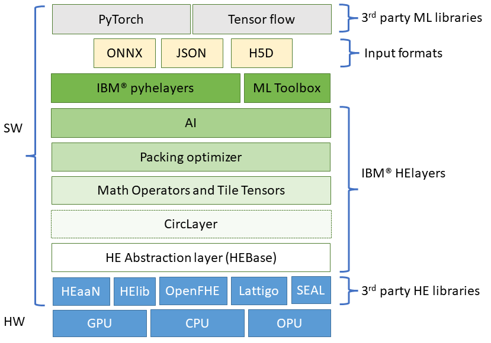
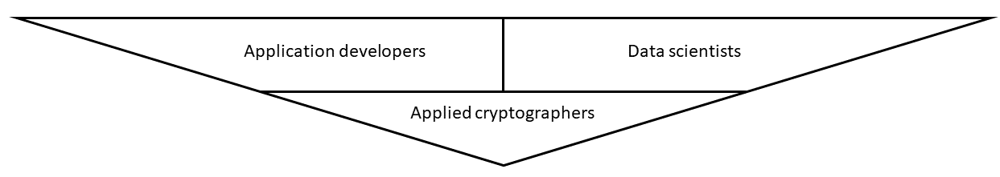

???+ "FHE overview"
    If you are unfamiliar with FHE, it is recommended to first visit the [FHE overview page](fhe_overview.md).

HElayers is an SDK that enables data scientists and application developers to easily use the power of FHE for developing and deploying FHE into their applications. HElayers is enabled with patented optimization and performance-boosting innovation for computation, AI innovation, and use case requirements that facilitate the practical use of a wide variety of AI workloads over FHE data. 

Use HElayers when you want to

- have a smooth transition from a non-encrypted environment to a privacy preserving one,
- enjoy special crafted optimizations that would otherwise require cryptographic and specific library knowledge to run efficiently, and
- enable HE-based computations without dependence on a specific homomorphic encryption library

## Layered design

HElayers is designed with a layered set of capabilities, where every layer is coupled with appropriate C++ or Python APIs. It uses low-level HE cryptographic libraries such as [HEaaN](https://www.cryptolab.co.kr/en/products-en/heaan-he/), [HElib](https://github.com/homenc/HElib), [SEAL](https://github.com/microsoft/SEAL), [OpenFHE](https://www.openfhe.org/), and [Lattigo](https://github.com/tuneinsight/lattigo) and adds functionality on top of them in a layered structure. These layers aim to provide the most for the various user types HElayers has. A concrete description of the layers is provided per user type below.

???+ Question "Does HElayers requries a specific HW?"
    HElayers offers its users the same HW support that the underlying HE library of choice provides. For example, HEaaN supports CPUs and GPUs, while SEAL only supports CPUs. Check the [installation page](installation.md) to learn more about the different HW capabilities of the supported libraries.

???+ Question "Does HElayers depend on a specific ML package such as Pytorch or TensorFlow?"
    No, HElayers receives inputs from ML Python packages such as [Pytorch](https://pytorch.org/) or [TensorFlow](https://www.tensorflow.org/) by using common file formats such as [ONNX](https://onnx.ai/). Other packages that can work with these formats can automatically enjoy HElayer's capabilities. Note that currently ONNX is only partially supported by HElayers, see the [ONNX manual page](onnx.md) for more info. current HElayers ONNX 

### HElayers user types

=== "Application developers"

    The most high-level 

=== "Data Scientists"

=== "Data Scientists (Researchers)"

=== "Applied cryptographers"

    Applied cryptographers are users who like to work directly with FHE primitives. 
    
    **HEBase:** This layer contains abstract interfaces that wrap the underlying 3rd-party HE APIs. This layer enables developers to access different libraries using the same set of APIs and thus allows the to write library-agnostic and scheme-oblivious code (as much as possible).

## Developers FAQ

??? Question "Is there any special background I should have to be a successful FHE programmer right now?"
    Today, you may need some additional background in computer science or a related subject to be an effective FHE programmer depending on your use case. If you are a programmer that would like to develop FHE schemes, then you need to be a cryptographer. If you want to be a programmer that works directly with the lower level APIs provided by HElib for free, you need to be familiar with FHE schemes, the special considerations in using them, and the domain that you're working with (e.g. neural networks).

    HElayers offers high-level APIs that allow you to solve AI and other problems without requiring background knowledge of FHE. For example, if you're used to working with neural networks in a standard library like Keras, HElayers can provide you with the tools necessary to import and convert your work to homomorphic encryption.

??? Question "Does FHE require any code or application changes?"
    Generally, yes FHE requires code changes. Some things that are easy to do with plaintext, or unencrypted data, are difficult to do with homomorphic encryption schemes. For example, a common function like MAX (taking the maximum of two numbers) is easy to compute using plaintext, but very difficult to compute using encrypted data.

    Algorithms need to be changed to make them 'HE friendly' so that they are able to be decomposed into three foundational FHE primitives of multiplication, addition and rotation.

    For complex operations, if there is no direct implementation feasible due to performance requirements, one must substitute the desired function by polynomial approximation. Over time, the  API (Application Programming Interface) library will provide more functions that have been implemented using the three FHE primitives. Our goal is to make the developer experience as comfortable and familiar as possible, while minimizing the number of changes that is needed to implement FHE.

??? Question "Do you need to approximate computations with polynomials to make it compatible with FHE?"
    Yes. Most FHE schemes only provide two basic operators: addition and multiplication. This means that everything you compute will have to be a polynomial or approximated using polynomials. The larger the polynomial, the better the approximation. However, having larger polynomials means it will be more difficult to compute. For example, if you have a function involving a square root, division, and MAX operators, it may be very easy to do using plaintext. But for FHE, it will result in a complicated polynomial and will be much slower to compute. This again touches why in principle everything is possible to compute under homomorphic encryption, but in practice, it's not always practical.

??? Question "Any special challenges with testing and debugging FHE programs?"
    There are three main challenges with testing and debugging FHE programs. The first is that because encrypted computations require more resources than unencrypted computations, computations are slower. The second is the additional layer of complexity that is created due to the constraints of working with ciphertext of a fixed size. The last challenge is the error (noise) that needs to be managed that is inherent to FHE operations.

    In HElayers, we provide tools to help address these challenges. For example, we offer APIs to measure noise and compare the computation in plaintext with a computation done under encryption. This allows you to track how the noise grows and manage the noise.

??? Question "What can I program with FHE? What can’t I program with FHE?"
    In principle, the 'Fully' in Fully Homomorphic Encryption means that you can compute on any function that you want. However, in practice, some computations are very difficult to the point of being impractical.

    FHE computation is most similar to a hardware circuit; we get the data, we run it through a sequence of gates and each gate performs an operation. Because the data remains encrypted and we are not able to see it in the clear, it is difficult to perform branching with FHE (e.g. if the data meets a certain condition, do X, else do Y). As a result, the data must run through all of the gates.

??? Question "What programming constructs are not available on FHE in terms of control flow?"
    There is no control flow for FHE - the input arrives and it runs through a circuit involving gates. You can't branch at all no ifs, no loops. It's like one big circuit.

??? Question "What is the performance and speed of FHE now?"
    Performance is dependent on the use case and the corresponding implementation. For many applications, FHE is fast enough now to be used. This is especially the case when FHE enables workloads that could not have been computed in an automated fashion before due to privacy or data sharing concerns.

??? Question "Are there any special CPUs that are needed?"
    There are no special CPUs or hardware that is strictly needed to perform FHE operations. However, FHE is computationally intensive and utilizing faster processors with larger cache sizes and memory capacity will result in better performance.

??? Question "What is the slowdown in terms of CPU I should expect for FHE vs non FHE operations?"
    It depends on the use case. Generally, encrypted computations require more resources than unencrypted computations. Overhead can be as low as a factor of two, or as a high as a factor of 1,000. If you are processing in batches, you'll get much better performance because the operations are SIMD (Single Instruction, Multiple Data). Note that when you are able to work with batches, you are not just looking at latency, but rather on the amortized times and throughput of an overall system design which can lead to better performance.

