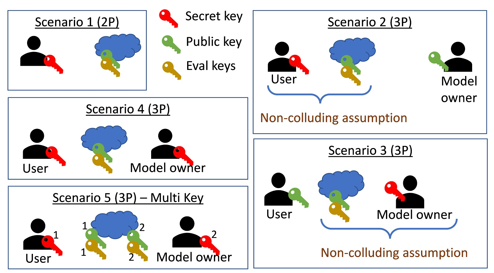

Commercial application developers should consider the threat model and security assumptions of their application before, and during using HElayers. Below we give some examples of such assumptions, of course, one page cannot cover all, thus, we limit its scope to *non-interactive* protocols that use FHE. These protocols allow us to leverage the potential of FHE by completely offloading computations to the server; the only interactions with it are done by sending a query (input) and receiving some encrypted answers (output). 

??? info "Adversaries types"
    It is common to define three adversary types.

    - **Semi-honest or honest-but-curious adversaries**. These adversaries follow the protocol (code/algorithm) specification without deviating from it. They are allowed to record the data during the protocol execution and try to recover information from it later on in an offline stage.
    - **Malicious adversaries**. These are the most powerful adversaries. They can deviate from the protocol and try to affect the final or intermediate results by injecting false data or performing some data manipulation. In addition, they are allowed to collect the data and perform offline attacks similar to semi-honest attackers.
    - **Covert adversaries**. These adversaries have similar capabilities to malicious adversaries. However, they get penalties if the user catches them cheating. A threat model that considers covert adversaries should take into consideration the costs to mount an attack and compare them to the expected penalty that the adversary gets. 

Modern state-of-the-art FHE applications consider only passive adversaries, i.e., semi-honest or honest-but-curious adversaries. One reason is that the [malleability](https://en.wikipedia.org/wiki/Malleability_(cryptography)) properties of FHE allow a malicious or covert adversary who deviates from a given protocol to manipulate the protocol output such that the decrypted results will be wrong.  To take into account also the integrity of the computations, application developers should use additional cryptographic machinery. For example, Trusted Execution Environemnts (TEEs) such as [IBM Hyper Protect Virtual Server (HPVS)](https://www.ibm.com/cloud/hyper-protect-virtual-servers) or [Intel SGX](https://www.intel.com/content/www/us/en/developer/tools/software-guard-extensions/overview.html) as suggested [here](https://doi.org/10.22667/JOWUA.2018.03.31.086). These mechanisms are outside the scope of this page.

??? note "side-channel protection"
    The final threat model should take into account attacks against the implementations of the suggested solutions. Specifically, it should consider side-channel attacks that attempt to extract secret information before encryption or the secret keys themselves. See for example [here](https://doi.org/10.1007/978-3-031-07689-3_8).

The figure  above presents five possible scenarios together with their threat model assumptions. 

=== "Scenario 1" 
    This scenario involves two parties (2P) a user and a cloud server. This is the simplest scenario, where the user holds the secret key and is allowed to encrypt and decrypt data, while the cloud only has access to the public and the evaluation keys, which means that it cannot decrypt and observe the underlying data. In this scenario, the confidentiality of the user's data is maintained by the [semantic security](https://en.wikipedia.org/wiki/Semantic_security) provided by the underlying FHE scheme. 
    
    This scenario applies, for example, when the user aims to maintain a secure database where the records are encrypted using FHE while still being able to query it. Another case is when a user aims to perform some analytics on the cloud by first training a model that may or may not be encrypted, storing the model encrypted on the cloud, and subsequently querying the model on some private input sample. 

=== "Scenario 2"
    This scenario involves a three-party (3P) configurations with two different entities and one cloud server.

    A typical example is when performing a machine learning inference operation. The right entity is always called the **data owner**, who owns a secret trained model. The data owner would like to offer the model as a service to its **users** without revealing it to the cloud or the users. For this to happen, it needs to encrypt the model and upload it encrypted to the cloud. Subsequently, the users can send their private input samples to the cloud, which evaluates the model homomorphically on the data and outputs the encrypted results. 

    Here, the end users own the secret key, the cloud should get access to the public and evaluation keys needed to perform the required computations. The model owner should get access and use the public key to encrypt its model. To ensure that the cloud does not ask the users to decrypt the model, we **have to assume that the cloud and the users are not colluding**. 

    Advantages:
    
    - Allows the users to upload a query and decrypt the results by themselves in real-time. 
    - Reduces the model-owner overhead by allowing the model-owner to fully utilize the compute powers of the cloud and stay offline during the entire inference process. 
    - The secret keys are often smaller than the other keys, which can reduce bandwidth. 

    Disadvantage:

    - Every user gets access to the secret key. This can increase the attack surface when the key is handled locally on the different users' devices. Even one breach can invalidate the security of the entire system. 
    

=== "Scenario 3"
    This scenario involves a three-party (3P) configurations with two different entities and one cloud server.

    A typical example is when performing a machine learning inference operation. The right entity is called the **data owner**, who owns a secret trained model. The data owner would like to offer the model as a service to its **users** without revealing it to the cloud or the users. For this to happen, it needs to encrypt the model and upload it encrypted to the cloud. Subsequently, the users can send their private input samples to the cloud, which evaluates the model homomorphically on the data and outputs the encrypted results. 

    Here, the data owner is the secret key owner, and the users only use the public key to encrypt their samples. Here too, **we need a non-collusion assumption to protect the users' data; but this time it's between the cloud and the data owner**. 

    Advantages:

    - Reduced attack surface, only the model-owner gets access to the secret key. 
    
    Disadvantage:

    - The users must go through the model owner to decrypt the inference results. This scenario is practical, for example, in voting systems, where there are many users; each one encrypts its own vote and the cloud server aggregates the results. The model (poll) owner is involved only in the final decryption and presentation of the results.

=== "Scenario 4"

    Scenario 4 can be seen as an extension of Scenario 1 to the three-party case. Here, both the model owner and the users have access to the private key. This scenario can happen, for example, when the two entities belong to the same company and hold the same permissions to use and see some private data.

=== "Scenario 5"
    This scenario considers an FHE extension to the multi-user case called MK-FHE see [survey](https://doi.org/10.1145/3477139). Every entity has a different secret key, and the cloud's encrypted evaluation considers ciphertexts encrypted under different keys. It  uses the two public keys and two evaluation keys that are associated with the different secret keys. 
    
    Advantages:

    - Every party can decrypt the results. 
    - Every party holds its own secret key.
    
    Disadvantage:

    - This solution involves much slower computations and higher bandwidth consumption. 

??? note "More than 3 parties"
    While the figure refers to 2-3 parties, in practice there can be many users with different roles and access rights to the same set of keys. A solution designer should take all of them into account. While the choice of a threat model is critical, it often depends not only on the security guarantees it provides but also on the engineering capabilities it can support; these, in turn, depend on the latency and bandwidth of managing the keys.

## Security FAQ

??? question "What security guarantees does HElayers provide for my unencrypted confidential data?"
    HElayers relies on 3rd party libraries to provide FHE capabilities, as such it depends on the security guarantees that these libraries provide. Commercial applications that use HElayers with a backend of choice, must ensure they review and understand the security guarantees that this backend provides. 

    With that said, the code of HElayers that deals with data to be encrypted (`PTiles`, `PTileTensors`, or the keys contexts) is handled in a constant-time manner, i.e., it does not leak timing info that depends on the data.

??? question "What security guarantees does HElayers provide for my encrypted data?"
    By the properties of the FHE of choice, once the data is encrypted, it can be decrypted only by the secret key holder. When an application does not provide HElayers with the secret key, HElayers, the systems it is integrated with, and the environment in which it runs cannot learn anything about the data.

??? question "Does HElayers code is side-channel secure?"
    The code of HElayers that deals with data to be encrypted (`PTiles`, `PTileTensors`, or the keys contexts) is handled in a constant-time manner, i.e., it does not leak timing info that depends on the data. Note that once the data is encrypted, no leakage (timing, power, etc.) is possible because HElayers only gets to see encrypted data, and cannot perform any data-dependent operation that may leak information.

    Similar to most of the HElayer's underlying backends, power, electromagnetic, and fault attacks fall outside the scope of the HElayers security model. Commercial applications that run in environments where these attacks are possible should use relevant protection mechanisms.

??? question "Does HElayers provide a quantum safe solution?"
    Yes, HElayers only use FHE schemes that rely on quantum-safe lattice-based cryptography.

??? question "Does HElayers is compliance with FIPS 140?"
    No, FHE is a new technology in terms of cryptography and the National Institute of Standards and Technology (NIST) has not yet generated a standard for FHE. To be FIPS 140 compliant, a product must use only encryption that was standardized by NIST. Today, there are efforts to [standardize FHE in ISO](https://www.iso.org/standard/83139.html), which we hope evolve also to NIST standardization of FHE in the future.

??? question "Can I store the FHE secret key on disk?"
    No, like with all public-private key cryptography systems, it is important to keep the secret key protected. Interactions with your secret key should only be done from a trusted environment and should not be revealed to anyone except the data owner.

??? question "Are there specifiic security recommendations when using CKKS?"
    Yes, please follow the [ISO (draft) standard](https://www.iso.org/standard/83139.html) recommendations. In general, it is important to keep the decryptions of CKKS ciphertexts as private information only available to the secret key owner. This is due to the potential of leaking the secret key attack of [Li and Micciancio](https://eprint.iacr.org/2020/1533). When an application needs to share this information, e.g., as part of some protocol, the number of bits shared should be kept to a minimum, and secret keys should be rotated regularly.  Note that some backends use special techniques to mitigate the above issue. It is recommended, that commercial applications that use CKKS be carefully reviewed by cryptography experts who are familiar with FHE security models and the underlying backend.

??? question "Does FHE require special key handling?"
    Yes, FHE involves keys that serve different purposes compared to other symmetric and asymmetric cryptographic schemes such as bootstrapping and evaluation keys. Today, there is not yet a standard that defines how to handle these keys. For convenience, we provide one way of handling them [here](keys.md). However, commercial applications should assist security and cryptography experts before using any of the examples described therein.
    